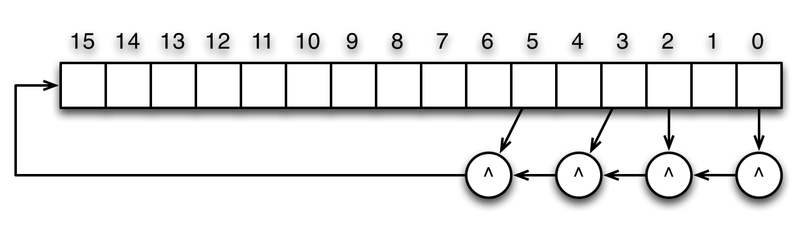

## Chisel Assignments and Re-assignments
When you first define a value in Chisel, we use the *=*+ operator in order to tell Chisel to allocate the value for the first time. On every subsequent reassignment to the value, we must use a *:=* when reassigning the value.

Since we are constructing a digital circuit, the notion of reassignment does not make much sense since connections between circuit nodes only need to be specified once. However, there are some cases when we will need to perform reassignment to a value in Chisel since it is compiled sequentially unlike Verilog. Thus it may be necessary to perform reassignment when a value or connection is not known until later in the Chisel source. 

A simple example of when reassignment is necessary is in the construction of the top level I/O for your module; the values of the output are not immediately known at the time of declaration.

Consider the simple *FullAdder* circuit from previous tutorial that determines the sum *sum* and carry out *cout* given two values *a* and *b*, and a carry in *cin*.

```scala
class FullAdder extends Module {
  val io = new Bundle {
    val a    = UInt(INPUT, 1)
    val b    = UInt(INPUT, 1)
    val cin  = UInt(INPUT, 1)
    val sum  = UInt(OUTPUT, 1)
    val cout = UInt(OUTPUT, 1)
  }

  // Generate the sum
  val a_xor_b = io.a ^ io.b
  io.sum := a_xor_b ^ io.cin
  // Generate the carry
  val a_and_b = io.a & io.b
  val b_and_cin = io.b & io.cin
  val a_and_cin = io.a & io.cin
  io.cout := a_and_b | b_and_cin | a_and_cin
}
```
In this example we make sure to use the *:=* reassignment for the *io.sum* and *io.cout* output values because we only know what their values are later in the code and not at the time of construction of the *io* Bundle. All other values in this example use the *=* assignment operator since they need to be created. 

In general, the rule of thumb is to use the reassignment operator *:=* if the value already has been assigned by the *=* operator, otherwise the *=* operator should be used. Note that if you do not use the *=* or *:=* operators correctly you will get an error when you try and compile your design.

### The Chisel UInt Class


In the previous examples we have been using the UInt type which is an unsigned integer as the type for all of our values. For many of the basic computations in Chisel the UInt class is sufficient. The following example shows some of the commonly used UInt operations in the context of a simple *ALU*

>We ignore overflow and underflow in this example.

```scala
class BasicALU extends Module {
  val io = new Bundle {
    val a = UInt(INPUT, 4)
    val b = UInt(INPUT, 4)
    val opcode = UInt(INPUT, 4)
    val out = UInt(OUTPUT, 4)
  }
  io.out := 0.U //THIS SEEMS LIKE A HACK/BUG
  when (io.opcode === 0.U) {
    io.out := io.a //pass A
  } .elsewhen (io.opcode === 1.U) {
    io.out := io.b //pass B
  } .elsewhen (io.opcode === 2.U) {
    io.out := io.a + 1.U //increment A by 1
  } .elsewhen (io.opcode === 3.U) {
    io.out := io.a - 1.U //increment B by 1
  } .elsewhen (io.opcode === 4.U) {
    io.out := io.a + 4.U //increment A by 4
  } .elsewhen (io.opcode === 5.U) {
    io.out := io.a - 4.U //decrement A by 4
  } .elsewhen (io.opcode === 6.U) {
    io.out := io.a + io.b //add A and B
  } .elsewhen (io.opcode === 7.U) {
    io.out := io.a - io.b //subtract B from A
  } .elsewhen (io.opcode === 8.U) {
    io.out := io.a < io.b //set on A less than B
  } .otherwise { 
    io.out :=  (io.a === io.b).asUInt() //set on A equal to B
  }
}
```

You will notice that there are multiple reassignments to *io.output*+ inside a *when*+ block which indicates that the value of *io.output*+ can take many different values depending on the *io.opcode*+ in this example. Also notice that in order to specify constants to add to our operands, we must also specify them as a UInt type as UInt operations on different type operands is not allowed.

```scala
// Specify that 1 is a UInt type
io.output := io.a + 1.U 
```

A list of commonly used UInt operations is given in the table below:

| Operand | Operation | Output Type |
| ------- | --------- | ----------- |
| + | Add | UInt  |
| - | Subtract | UInt  |
| * | Multiply | UInt |
| / | UInt Divide | UInt |
| % | Modulo | UInt |
| ~ | Bitwise Negation | UInt |
| ^ | Bitwise XOR | UInt|
| & | Bitwise AND | UInt |
| \| | Bitwise OR | Bool |
|=== | Equal | Bool |
|=/= | Not Equal | Bool |
|> | Greater | Bool |
|< | Less | Bool |
|>= | Greater or Equal | Bool |
|<= | Less or Equal | Bool |

### Bit Extraction

The UInt class allows you to extract bits based on their index of their representation. Given an *n*+ bit wide value *value* we can extract the bits *x*+ through *y*+ (n > x > y >= 0) by simply doing the following:

```scala
// extracts the x through y bits of value
val x_to_y = value(x, y) 
```

Note that the higher index is specified first in the argument list when extraction the bits. Also notice that the bits in the UInt are zero indexed so the highest bit that can be extracted from an *n*+ bit wide value is *n-1*+.

If you just want to extract a single bit from the value, say bit *x*+ we simply need to specify a single index instead as follows:
```scala
// extract the x-th bit from value
val x_of_value = value(x)
```

A more concrete example of bit extraction in action is shown below. In this example, based on the value of the offset, we would like to select a byte from a word which is a common operation when loading a byte from word addressed memories:

```scala
class ByteSelector extends Module {
  val io = new Bundle {
    val in     = UInt(INPUT, 32)
    val offset = UInt(INPUT, 2)
    val out    = UInt(OUTPUT, 8)
  }
  io.out := UInt(0, width=8)
  when (io.offset === UInt(0, width=2)) {
    io.out := io.in(7,0)
  } .elsewhen (io.offset === 1.U) {
    io.out := io.in(15,8)
  } .elsewhen (io.offset === 2.U) {
    io.out := io.in(23,16)
  } .otherwise {
    io.out := io.in(31,24)
  }
}```

### Bit Concatenation}

Chisel also allows you to easily concatenate bits together using *Cat*. Suppose you have a data bus that you would like to drive with two seperate words *A* and *B*. In order to concatenate these two values together we simply sa:

```scala
val A = UInt(width = 32)
val B = UInt(width = 32)
val bus = Cat(A, B) // concatenate A and B
```

Again, the first argument to *Cat* will be placed in the high part while the second argument gets the low part of *bus*. Thus for this example bits 0 to 31 of *bus* correspond to *B*, while bits 32 to 63 correspond to *A*. 

### **LFSR16**

In this assignment, write the *LFSR16*+ circuit as shown below:



by filling in the following module:

```scala
class LFSR16 extends Module {
  val io = new Bundle {
    val inc = Bool(INPUT)
    val out = UInt(OUTPUT, 16)
  }
  // ...
  io.out := UInt(0)
}
```
found in *$TUT_DIR/src/main/scala/problems/LFSR16.scala*+.
Make sure to define and initialize an internal register to one and 
update it when *inc*+ is asserted.
Use bit concatentation and bit extraction 
in conjunction with the xor operator *^*.  Run 

```bash
sbt
test:run-main problems.Launcher LFSR16
```
Fix your program as necessary and re-run until it works.

### UInt Operation Bit Inference}

Note that for some operations such as addition and multiplication, that number of resulting bits of the computation can be greater than the number of bits for the operands. 

Consider the following example where we multiply two 16 bit numbers *A* and *B* together. Note that the product of two 16 bit numbers is at worst 32 bits wide.

```scala
class HiLoMultiplier() extends Module {
  val io = new Bundle {
    val A  = UInt(INPUT, 16)
    val B  = UInt(INPUT, 16)
    val Hi = UInt(OUTPUT, 16)
    val Lo = UInt(OUTPUT, 16)
  }
  val mult = io.A * io.B
  io.Lo := mult(15, 0)
  io.Hi := mult(31, 16)  
}

```

Notice that we never specify the width of the value *mult* anywhere in the Chisel source. Normally if we performed this in Verilog we would have had to specify the width beforehand. But a look at the generated Verilog for this example shows that Chisel correctly inferred the *mult* value to be 32 bits wide:

```scala
module HiLoMultiplier(
    input [15:0] io_A,
    input [15:0] io_B,
    output[15:0] io_Hi,
    output[15:0] io_Lo);

  wire[15:0] T0;
  wire[31:0] mult; // Chisel infers this to be 32 bits
  wire[15:0] T1;

  assign io_Lo = T0;
  assign T0 = mult[4'hf:1'h0];
  assign mult = io_A * io_B;
  assign io_Hi = T1;
  assign T1 = mult[5'h1f:5'h10];
endmodule

```
### UInt Operation Bit Inference}

Note that for some operations such as addition and multiplication, that number of resulting bits of the computation can be greater than the number of bits for the operands. 

Consider the following example where we multiply two 16 bit numbers *A* and *B* together. Note that the product of two 16 bit numbers is at worst 32 bits wide.

```scala
//A 4-bit adder with carry in and carry out
class HiLoMultiplier() extends Module {
  val io = new Bundle {
    val A  = UInt(INPUT, 16)
    val B  = UInt(INPUT, 16)
    val Hi = UInt(OUTPUT, 16)
    val Lo = UInt(OUTPUT, 16)
  }
  val mult = io.A * io.B
  io.Lo := mult(15, 0)
  io.Hi := mult(31, 16)
}
```

Notice that we never specify the width of the value *mult* anywhere in the Chisel source. Normally if we performed this in Verilog we would have had to specify the width beforehand. But a look at the generated Verilog for this example shows that Chisel correctly inferred the *mult* value to be 32 bits wide:

```scala
module HiLoMultiplier(
    input [15:0] io_A,
    input [15:0] io_B,
    output[15:0] io_Hi,
    output[15:0] io_Lo);

  wire[15:0] T0;
  wire[31:0] mult; // Chisel infers this to be 32 bits
  wire[15:0] T1;

  assign io_Lo = T0;
  assign T0 = mult[4'hf:1'h0];
  assign mult = io_A * io_B;
  assign io_Hi = T1;
  assign T1 = mult[5'h1f:5'h10];
endmodule

```

As we get to more complicate designs, it will become more clear that bit inference in Chisel is a very powerful feature that makes constructing hardware more efficient. A list of common bit inferences is shown below for commonly used operations:


| Operation | Result Bit Width |
| --------- | ---------------- |
|*Z = X + Y*   |  max(Width(X), Width(Y))  |
|*Z = X - Y*   |  max(Width(X), Width(Y)) |
|*Z = X + Y*   |  max(Width(X), Width(Y)) |
|*Z = X | Y*   |  max(Width(X), Width(Y)) |
|*Z = X ^ Y*   |  max(Width(X), Width(Y)) |
|*Z = ~X*      |  Width(X) |
|*Z = Mux(C, X, Y)*   |  max(Width(X), Width (Y)) |
|*Z = X * Y*   |  Width(X) + Width(Y) |
|*Z = X << n*   |  Width(X) + n |
|*Z = X >> n*   |  Width(X) - n |
|*Z = Cat(X, Y)*   |  Width(X) + Width(Y) |
|*Z = Fill(n, x)*   |  Width(X) + n |


[Prev (The Basics)](The Basics)  [Next (Instantiating Modules)](Instantiating Modules)